​		Challenge Author(s): Abdelrhman

​		

 


### Description:


: I was trying to make my homework but i found everything encrypted after that  can you descover what happened?

### Objective

* Knowing about disk forensics
* knowing about analyzing browser history
* Knowing about encryption
* knowing about how to analyze .exe


### Difficulty:

`Hard`


# Challenge

we have .ad1 file so let's open ftk imager and import this file 
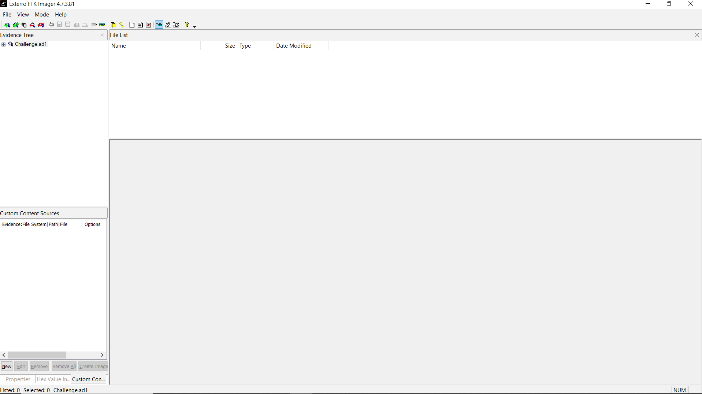

so let's search for all files in Downloads dir and Documents dir
we found there is file `flag.txt.enc`
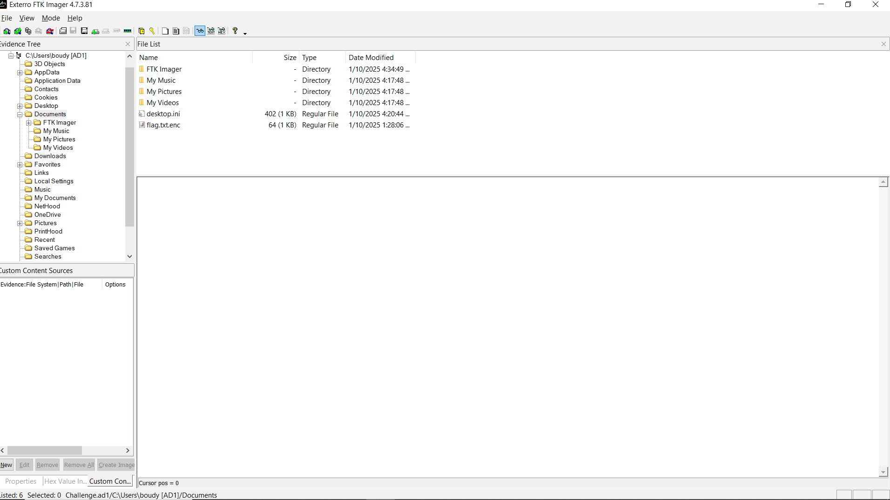
so right click on it to extract it you will find it encrypted so there is ransomware file made that so after we search we will not find it so maybe ransomware downloaded from browser so we need to look for all links and visited urls that the user visit 
**browser history file path** `AppData/Local/Microsoft/Edge/UserData/Default/History`
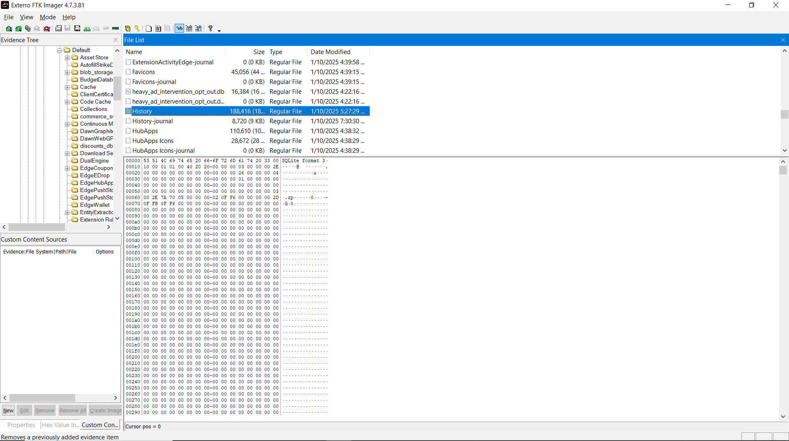
ok now let's export it by right click on it then open it at `DB broser (sql lite)`
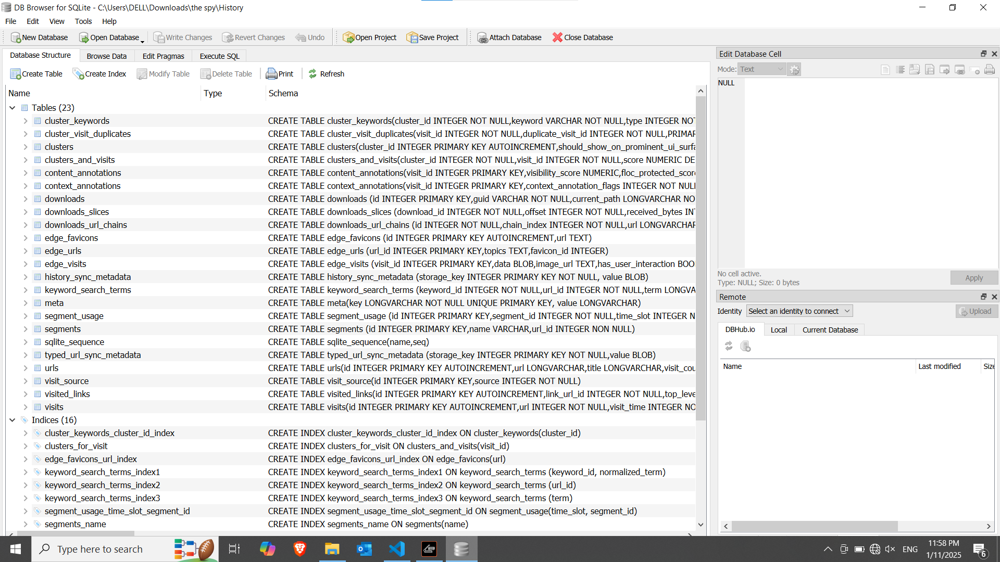
ok now we need to see downloaded files so we will goto downloads and right click on it then choose `Broswe Table`
we will see 2 files downloaded `office.exe` and `flag.txt.enc`
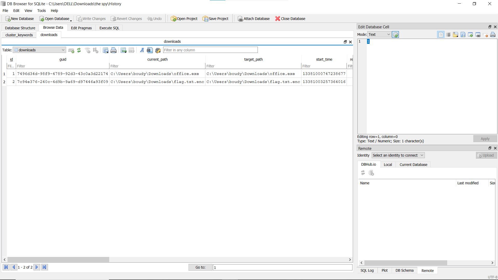
so let's show the url that `office.exe` downloaded from we will see it from drive not from the official link of office so it's sus let's download this file from that link
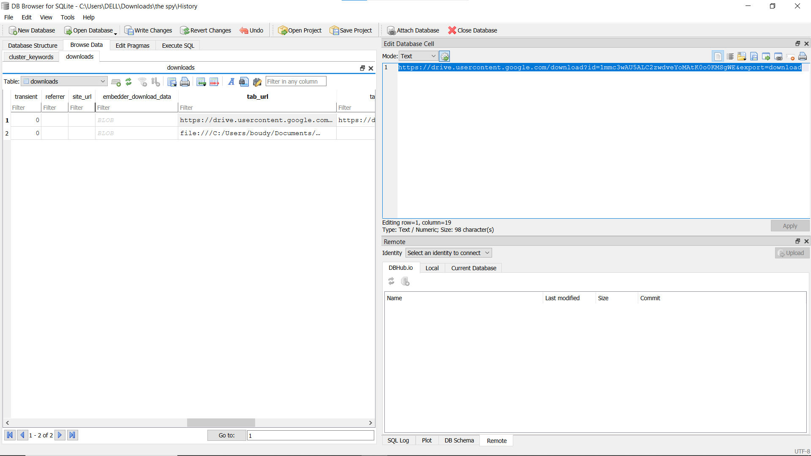 
ok now let's run **strings** on it we will see it have `pyinstaller` so that mean it written in python language so we can retrieve the origianl code
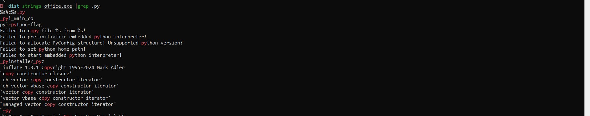
so we will need to extract all .pyc from office.exe so we will use **pyinstxtractor office.exe**
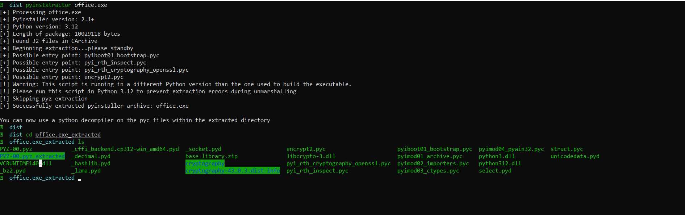
ok now we extracted the .pyc from office.exe so now we will need to use tool to decompile it so we will use **pydisasm** for this process
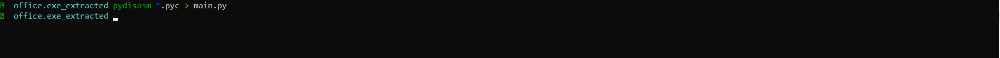
now let's open **main.py** to understand what is this code doing
ok we will see some intersting words like `Abdelrhman` `Encryption`
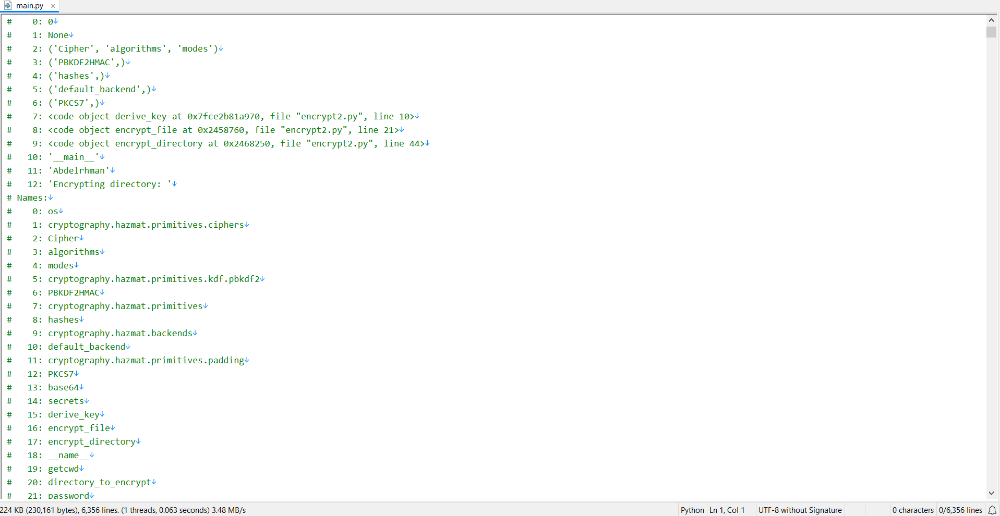
ok after we read the code you will understand that it encrpt files using **AES CBC** and using the key for encryption : **Fixed Password +salt** so he used `Abdelrhman` as Fixed Password and he saved `salt` at **salt.bin** file  about iv he used random 16 bytes for each file so you will need to get iv to read first 16 bytes from each file so now to get full key we need **salt.bin** so let's search about it at `ad1` file we will find attacker hide it at `AppData/Local/`
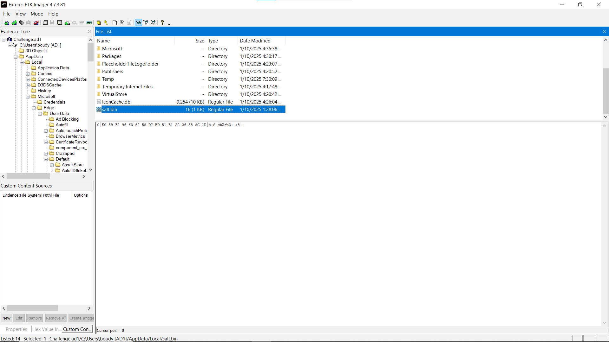
now we need to write code to decrypt the files that encrypted 
**key** : Abdelrhman +content of salt.bin
**Encryption**: AES CBC
**iv** : First 16 bytes of file 
the code to decrypt it :
```py
import os
from cryptography.hazmat.primitives.ciphers import Cipher, algorithms, modes
from cryptography.hazmat.primitives.kdf.pbkdf2 import PBKDF2HMAC
from cryptography.hazmat.primitives import hashes
from cryptography.hazmat.backends import default_backend
from cryptography.hazmat.primitives.padding import PKCS7
import base64
import secrets
def derive_key(password, salt):
    """Derives a key from the password using PBKDF2."""
    kdf = PBKDF2HMAC(
        algorithm=hashes.SHA256(),
        length=32,
        salt=salt,
        iterations=100000,
        backend=default_backend()
    )
    return kdf.derive(password.encode())
def decrypt_file(file_path, key):
    """Decrypt a file with the given key."""
    with open(file_path, 'rb') as f:
        iv = f.read(16)
        ciphertext = f.read()

    cipher = Cipher(algorithms.AES(key), modes.CBC(iv), backend=default_backend())
    decryptor = cipher.decryptor()

    padded_plaintext = decryptor.update(ciphertext) + decryptor.finalize()

    # Remove padding
    unpadder = PKCS7(algorithms.AES.block_size).unpadder()
    plaintext = unpadder.update(padded_plaintext) + unpadder.finalize()

    # Save the decrypted file
    original_path = file_path[:-4]
    with open(original_path, 'wb') as f:
        f.write(plaintext)

    # Optionally, remove the encrypted file
    os.remove(file_path)

def decrypt_directory(directory, password):
    """Decrypt all encrypted files in the specified directory."""
    with open(os.path.join(directory, 'salt.bin'), 'rb') as f:
        salt = f.read()

    key = derive_key(password, salt)

    for root, _, files in os.walk(directory):
        for file in files:
            if file.endswith('.enc'):
                file_path = os.path.join(root, file)
                decrypt_file(file_path, key)
                print(f"Decrypted: {file_path}")

if __name__ == "__main__":
    directory_to_decrypt = input("Enter the directory to decrypt: ")
    password = "Abdelrhman"  # Fixed password
    decrypt_directory(directory_to_decrypt, password)

```
put the `salt.bin` file at directory with encrypted file you want to decrypt at our case we need to decrypt `flag.txt.enc` only so 
put them together and then run the code 
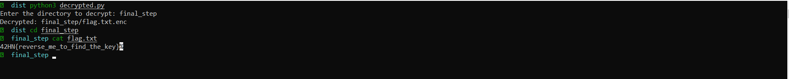
**Flag** :<mark>42HN{reverse_me_to_find_the_key}</mark>